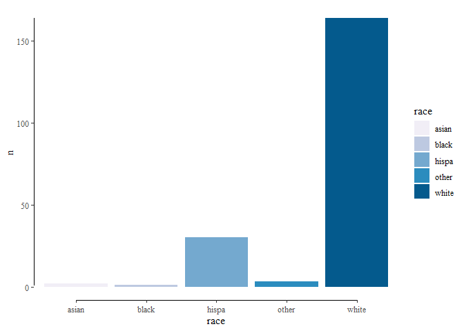

<!-- README.md is generated from README.Rmd. Please edit that file -->

# Introduction

This packages standardizes the output for the R packages
[**wru**](https://github.com/kosukeimai/wru "R: wru"),
[**predictrace**](https://rdrr.io/cran/wru/man/predict_race.html "R: predictrace"),
and includes a python script and virtual environment setup for the
python library
[**ethnicolr**](https://github.com/appeler/ethnicolr "Python: ethnicolr").

# Codes

``` r
library(rRace); library(reticulate); library(tidyverse); library(ggthemes)
#> -- Attaching packages --------------------------------------- tidyverse 1.3.2 --
#> v ggplot2 3.3.6     v purrr   0.3.4
#> v tibble  3.1.8     v dplyr   1.0.9
#> v tidyr   1.2.0     v stringr 1.4.0
#> v readr   2.1.2     v forcats 0.5.1
#> -- Conflicts ------------------------------------------ tidyverse_conflicts() --
#> x dplyr::filter() masks stats::filter()
#> x dplyr::lag()    masks stats::lag()
```

We test the package with a build-in table “name_table” which includes
some random names.

``` r
tab_names <- name_table
head(tab_names)
#> # A tibble: 6 x 8
#>      id first_name last_name gen      age state county tract 
#>   <int> <chr>      <chr>     <chr>  <dbl> <chr> <chr>  <chr> 
#> 1   144 Wynetta    Palma     female    40 AR    067    480500
#> 2   231 Bobbie     Garcia    female    41 FL    <NA>   <NA>  
#> 3   449 Rebecca    Beeson    female    51 IA    043    070100
#> 4   465 Georgie    Head      female    35 KS    115    489500
#> 5   470 Joyce      Langdon   female    40 KY    029    020400
#> 6   682 Mary       Guthrie   female    44 KY    107    970200
```

## Prediction based on predictrace

``` r
tab_prr <- race_prr(tab_names)
head(tab_prr)
#> # A tibble: 6 x 15
#>      id first_name last_name gen     age state county tract method pasian pblack
#>   <int> <chr>      <chr>     <chr> <dbl> <chr> <chr>  <chr> <chr>   <dbl>  <dbl>
#> 1     1 Michael    POWELL    male     47 AL    <NA>   <NA>  PRR-0~ 0.0042 0.266 
#> 2     1 Michael    POWELL    male     47 AL    <NA>   <NA>  PRR-1~ 0.0159 0.0214
#> 3     2 Cody       Maupin    male     35 AL    007    0100~ PRR-0~ 0.0053 0.0581
#> 4     2 Cody       Maupin    male     35 AL    007    0100~ PRR-1~ 0.0101 0.0121
#> 5     3 Kevin      Neff      male     48 AL    081    0421~ PRR-0~ 0.006  0.0092
#> 6     3 Kevin      Neff      male     48 AL    081    0421~ PRR-1~ 0.0324 0.0284
#> # ... with 4 more variables: phispa <dbl>, pwhite <dbl>, pother <dbl>,
#> #   race <chr>
#> # i Use `colnames()` to see all variable names
```

## Prediction based on wru

First we have to download census data

``` r
download_census(
  .key = "YOUR KEY",
  .geo = "county",
  .use_age = TRUE,
  .use_gen = TRUE,
  .dir = "_debug_data/census/",
  .workers = 10,
  .retry = 10,
  .progress = TRUE,
  .states = unique(tab_names$state)
)
#> All State-Age-Gender Census Data already Downloaded
```

``` r
tab_wru <- race_wru(
  .tab = tab_names,
  .use_geo = TRUE,
  .use_age = TRUE,
  .use_gen = TRUE,
  .census_dir = "_debug_data/census/",
  .census_geo = "county"
)

head(tab_wru)
#> # A tibble: 6 x 15
#>      id first_n~1 last_~2 gen     age state county tract method   pasian  pblack
#>   <int> <chr>     <chr>   <chr> <dbl> <chr> <chr>  <chr> <chr>     <dbl>   <dbl>
#> 1     1 Michael   POWELL  male     47 AL    <NA>   <NA>  WRU-0~  0.0046   0.271 
#> 2     1 Michael   POWELL  male     47 AL    <NA>   <NA>  WRU-0~ NA       NA     
#> 3     1 Michael   POWELL  male     47 AL    <NA>   <NA>  WRU-0~ NA       NA     
#> 4     1 Michael   POWELL  male     47 AL    <NA>   <NA>  WRU-0~ NA       NA     
#> 5     1 Michael   POWELL  male     47 AL    <NA>   <NA>  WRU-0~ NA       NA     
#> 6     2 Cody      Maupin  male     35 AL    007    0100~ WRU-0~  0.00610  0.0569
#> # ... with 4 more variables: phispa <dbl>, pwhite <dbl>, pother <dbl>,
#> #   race <chr>, and abbreviated variable names 1: first_name, 2: last_name
#> # i Use `colnames()` to see all variable names
```

## Prediction based on ethnicolr

### Python Setup

ToDO: Explain the Setup

``` r
.py_path <- filter(conda_list(), name == "env-ethnicolr")[[2]]
Sys.setenv(RETICULATE_PYTHON = .py_path)
reticulate::py_discover_config()
#> python:         E:/Programs/anaconda202205/envs/env-ethnicolr/python.exe
#> libpython:      E:/Programs/anaconda202205/envs/env-ethnicolr/python37.dll
#> pythonhome:     E:/Programs/anaconda202205/envs/env-ethnicolr
#> version:        3.7.13 (default, Mar 28 2022, 08:03:21) [MSC v.1916 64 bit (AMD64)]
#> Architecture:   64bit
#> numpy:          E:/Programs/anaconda202205/envs/env-ethnicolr/Lib/site-packages/numpy
#> numpy_version:  1.21.6
#> 
#> NOTE: Python version was forced by RETICULATE_PYTHON
```

### Load Function

The ethnicolr function is stored as a system file, you can easily load
it with the following command.

``` r
.path_py <- system.file("extdata/ethnicolr.py", package = "rRace")
reticulate::source_python(.path_py)
```

You can safely ignore the error about tensorflow (if present). It only
tells you that you don’t have a GPU setup on your machine.

As a reference the complete function (not necessary to execute it)

``` python
import os 
import pandas as pd 
import ethnicolr

def race_eth(tab, methods = ["CEL", "FLF", "FLL"]):
    
    # CEL: CENSUS DATA, prediction on LAST NAME ------------------------------------------
    if "CEL" in methods:
        df1 = ethnicolr.pred_census_ln(df=tab, namecol="last_name")
        cols = {'api': 'pasian', 'black': 'pblack', 'hispanic': 'phispa', 'white': 'pwhite'}
        df1.rename(columns=cols, inplace=True)
        df1["method"]="CEL-1-0-0-0-0-N"
    else:
        df1=pd.DataFrame()
    
    # FLF: FLORIDA DATA, prediction on FULL NAME -----------------------------------------
    if "FLF" in methods:
        df2 = ethnicolr.pred_fl_reg_name(df=tab, lname_col="last_name", fname_col="first_name")
        cols={'asian': 'pasian', 'nh_black': 'pblack', 'hispanic': 'phispa', 'nh_white': 'pwhite'}
        df2.rename(columns=cols, inplace=True)
        df2["method"]="FLF-1-1-0-0-0-N"
    else:
        df2=pd.DataFrame()
    
    # FLL: FLORIDA DATA, prediction on LAST NAME -----------------------------------------
    if "FLL" in methods:
        df3 = ethnicolr.pred_fl_reg_ln(df=tab, namecol="last_name")
        cols={'asian': 'pasian', 'nh_black': 'pblack', 'hispanic': 'phispa', 'nh_white': 'pwhite'}
        df3.rename(columns=cols, inplace=True)
        df3["method"]="FLL-1-1-0-0-0-N"
    else:
        df3=pd.DataFrame()
  
    # combine dataframes to single dataframe ----------------------------------------------------
    df_out=pd.concat([df1, df2, df3], ignore_index=True)
    df_out["pother"]=0
    
    # select and reorder columns ----------------------------------------------------------------
    cols_old=list(tab.columns.values)
    cols_old.remove("__name")
    cols_new=["method", "pasian", "pblack", "phispa", "pwhite", "pother", "race"]
    df_out=df_out[cols_old+cols_new]
    
    # recode race values ------------------------------------------------------------------------
    race_old=["hispanic", "nh_white", "nh_black"]
    race_new=["hispa", "white", "black"]
    df_out["race"]=df_out["race"].replace(race_old, race_new)
    
    # return output -----------------------------------------------------------------------------
    return df_out
```

Again, you can safely ignore the error about tensorflow (if present).

### Prediction (Ethnicolr)

``` r
tab_eth <- as_tibble(race_eth(tab_names))
head(tab_eth)
#> # A tibble: 6 x 15
#>      id first_name last_~1 gen     age state county tract method  pasian  pblack
#>   <dbl> <chr>      <chr>   <chr> <dbl> <chr> <chr>  <chr> <chr>    <dbl>   <dbl>
#> 1   144 Wynetta    Palma   fema~    40 AR    067    4805~ CEL-1~ 0.0159  0.00481
#> 2   231 Bobbie     Garcia  fema~    41 FL    NA     NA    CEL-1~ 0.0134  0.00148
#> 3   449 Rebecca    Beeson  fema~    51 IA    043    0701~ CEL-1~ 0.00443 0.137  
#> 4   465 Georgie    Head    fema~    35 KS    115    4895~ CEL-1~ 0.00751 0.133  
#> 5   470 Joyce      Langdon fema~    40 KY    029    0204~ CEL-1~ 0.0110  0.0199 
#> 6   682 Mary       Guthrie fema~    44 KY    107    9702~ CEL-1~ 0.00269 0.0797 
#> # ... with 4 more variables: phispa <dbl>, pwhite <dbl>, pother <dbl>,
#> #   race <chr>, and abbreviated variable name 1: last_name
#> # i Use `colnames()` to see all variable names
```

## Combine Predictions

``` r
tab_race <- race_predict(tab_prr, tab_wru, tab_eth)
head(tab_race)
#> # A tibble: 6 x 19
#>      id first_name last_n~1 gen     age state county tract method  pasian pblack
#>   <dbl> <chr>      <chr>    <chr> <dbl> <chr> <chr>  <chr> <chr>    <dbl>  <dbl>
#> 1     1 Michael    POWELL   male     47 AL    <NA>   <NA>  PRR-1~ 0.0159  0.0214
#> 2     1 Michael    Powell   male     47 AL    NA     NA    FLF-1~ 0.00217 0.202 
#> 3     1 Michael    Powell   male     47 AL    NA     NA    CEL-1~ 0.00506 0.277 
#> 4     1 Michael    POWELL   male     47 AL    <NA>   <NA>  PRR-0~ 0.0042  0.266 
#> 5     1 Michael    POWELL   male     47 AL    <NA>   <NA>  WRU-0~ 0.0046  0.271 
#> 6     1 Michael    Powell   male     47 AL    NA     NA    FLL-1~ 0.00940 0.382 
#> # ... with 8 more variables: phispa <dbl>, pwhite <dbl>, pother <dbl>,
#> #   hp <dbl>, gd <dbl>, race <chr>, rank_hp <int>, rank_gd <int>, and
#> #   abbreviated variable name 1: last_name
#> # i Use `colnames()` to see all variable names
```

# Output

## Race based on Highest Prob.

``` r
tab_race %>%
  filter(rank_hp == 1) %>%
  count(race) %>%
  ggplot(aes(race, n, fill = race)) + 
  geom_col() + 
  scale_fill_brewer(palette = "PuBu") +
  ggthemes::geom_rangeframe(color = "black") +
  ggthemes::theme_tufte()
```


## Race based on Guess Diff.

``` r
tab_race %>%
  filter(rank_gd == 1) %>%
  count(race) %>%
  ggplot(aes(race, n, fill = race)) + 
  geom_col() + 
  scale_fill_brewer(palette = "PuBu") +
  ggthemes::geom_rangeframe(color = "black") +
  ggthemes::theme_tufte()
```


